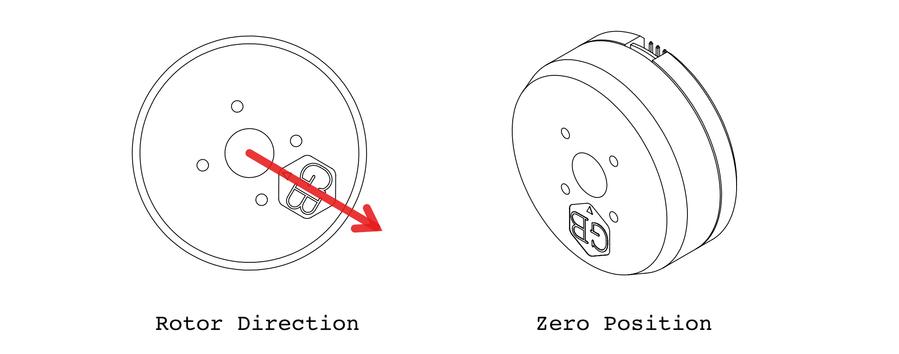
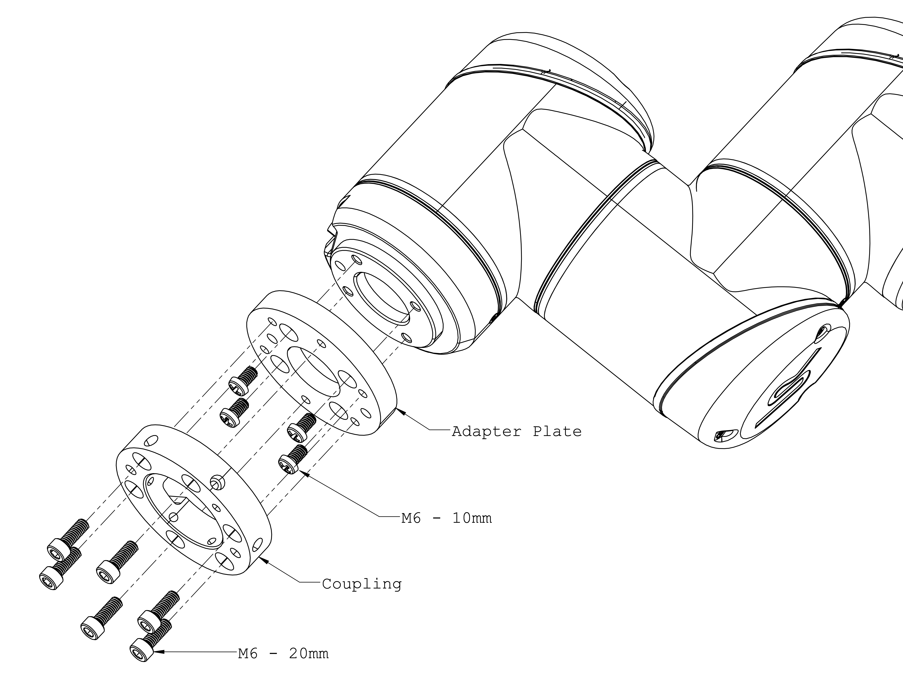
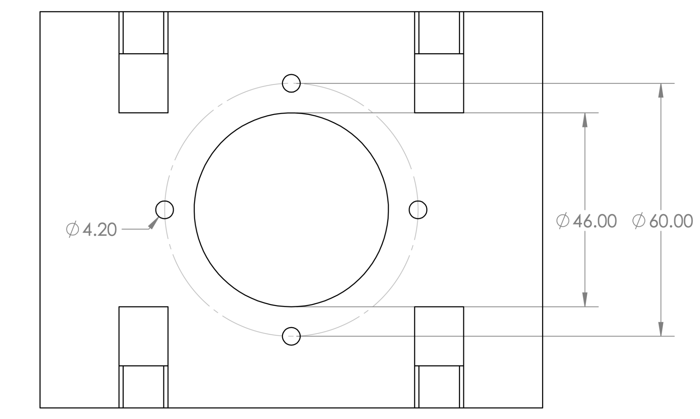

# Direct-Drive Gripper with Swivel Fingertips

$\color{red}{\textsf{TOO MANY TYPOS! EACH TYPO IS A DEFECT!}}$

We here introduce our latest direct-drive gripper. Compared to [the previous version](https://github.com/JS-RML/ddh_hardware) that we presented in [ICRA 2023](https://ieeexplore.ieee.org/document/10160263), the current one adopts swivel fingertips with passive compliance for enhanced adaptiveness.

<p align = "center">

</p>

-----

# Table of Contents

- [Preparation](#preparation)
  - [Bill of Materials (BOM)](#bom)
    - [Off-the-Shelf Parts](#purchase)
    - [3D Printing](#3d-printing)
- [Actuators](#actuators)
  - [Actuator Assembly ⨉4](#assemble-actuators)
  - [Wiring](#wiring)
    - [Power Supply](#power-supply)
    - [Encoder Connection](#encoder-connection)
    - [Motor Connection](#Motor-connection)
  - [Actuator Calibration](#actuator-calibration)
    - [Calibrate ODrives](#calibrate-odrives)
    - [Calibrate Zero Position](#calibrate-zero-position)
- [Gripper](#Gripper)
  - [Finger Assembly ⨉2](#finger)
  - [Gripper Assembly](#gripper-assembly)
  - [Mounting](#mounting-ur10)
  - [Validation](#validation)
- [Customization](#customization)
  - [Mounting](#custom-mounting)
  - [Geometry](#geometry)
  - [Fingertip](#fingertip)
- [Getting Started](#getting-started)
  
-----

# Preparation
<a name="bom"></a>
## Bill of materials (BOM)
<a name="purchase"></a>
### Off-the-shelf parts
- [T-motor gb54-2](https://store.tmotor.com/goods-445-GB54-2.html) X 4
- [Odrive s1](https://odriverobotics.com/shop/odrive-s1) X 4
- [AS5048A Encoder + solid magnet](https://ko.aliexpress.com/item/1005004239532357.html?spm=a2g0o.ppclist.product.16.189a33gr33grC1&pdp_npi=2%40dis%21KRW%21%E2%82%A9%2020%2C299%21%E2%82%A9%2020%2C299%21%21%21%21%21%402103011616813606980156478ed18f%2112000028490990365%21btf&_t=pvid%3A1729ba70-2e9e-4e62-ae44-2781def9d2bc&afTraceInfo=1005004239532357__pc__pcBridgePPC__xxxxxx__1681360698&gatewayAdapt=glo2kor) X 4
- [Bearing - outer-diameter = 100mm, inner-diameter = 6mm](https://kr.misumi-ec.com/vona2/detail/221000058378/?KWSearch=%eb%b2%a0%ec%96%b4%eb%a7%81&searchFlow=results2products) X 12
- [Wire terminal box](https://mini.freeship.co.kr/goods/content.asp?guid=14063350&freeship_ep=naver_ep&NaPm=ct%3Dlpapaqwg%7Cci%3Df02b7700f5a0e323cb475c55121ebd49967d7324%7Ctr%3Dsls%7Csn%3D405974%7Chk%3Da901253e6a96e25815c6a2b1212b2f65c958629d) X 1
- [Shielded cable](https://smartstore.naver.com/bantolmarket/products/10633794496) X 1   $\color{red}{\textsf{Where to purchase this off-the-shelf part?}}$
- [3-phase cable](https://smartstore.naver.com/shipdiy/products/7890381050?NaPm=ct%3Dlzm5hgao%7Cci%3D4a0c15cee6c5b52f39ab074a9168c12676b30c93%7Ctr%3Dsls%7Csn%3D165091%7Chk%3Ddfd07d72d70e606ba9bf143b348b70408f7f9bef) X 3 $\color{red}{\textsf{Where to purchase this off-the-shelf part?}}$


### 3D Printing
- [Bearing_insert_holder](stl/bearing_insert_holder.stl) X 2
- [Bearing pin](stl/bearing_pin.stl) X 2
- [Distal link](stl/distal_link.stl) X 2
- [Distal tip cap left](stl/L_distal_tip_cap.stl) X 1
- [Distal tip spring version left](stl/L_distal_tip_spring_ver.stl) X 1
- [Distal tip cap right](stl/R_distal_tip_cap.stl) X 1
- [Distal tip spring version right](stl/R_distal_tip_spring_ver.stl) X 1
- [Finger tip](stl/finger_tip.stl) X 2
- [Motor shell](stl/motor_shell.stl) X 1
- [Motor plate](stl/motorplate.stl) X 4
- [Proximal link](stl/proximal_link.stl) X 2
- [Proximal link pillar](stl/proximal_link_pillar.stl) X 2
- [Rotation limiter](stl/rotation_limiter.stl) X 2

# Actuators
$\color{red}{\textsf{Missing links to the images below.}}$

## Actuator assembly


## Wiring
The components should be connected following the diagram below. The encoder connection(black) and power connection(green) will be further elaborated.
 

### Power Supply
First connect the DC power supply to the wall plug. Then connect it to the four ODrive boards, positive to positive, negetaive to negative. There is no on/off button on the boards, plug in the wall plug to turn the system on, unplug to turn it off.


### Encoder Connection
For the encoder connection, we fabricate a cable assembly as shown below in the schematic. It is recommended to verify the connectivity and resistance of each connection to make sure the cables are soldered properly. We also recommend to label each connector like the schematic.


After successful fabrication, connect the motor encoders and the ODrives.

### Motor Connection
Keep the 3-phase connection consistent as shown below.


### Odirve S1 Pin map.


# Actuator Calibration

Each actuator module require calibration before use. This step __can not__ be done after the gripper is assembled, so do not postpone this step.

We explicitly define the `direction of the rotor` to be the direction the hexagonal logo on the rotor is pointing at, and the `zero position of the motor` to be when the direction of the motor is pointing at the opposite direction of the power port on the stator. 




## Calibrate ODrives
ODrive provides a GUI service for setting up the motordriver. ([Oodrive GUI](https://gui.odriverobotics.com/inspector)) You can set up the motordriver using this GUI. The configuration parameters are as follow.
# Power source
- DC bus overvoltage trip level: 26
- DC bus undervoltage trip level: 22
- DC max positive current: 'Leave it blank'
- DC max negative current: -0.5
# Motor
- Type: Gimbal
- Phase resistance: 2.675
- Pole pairs: 7
- KV: 26
- Current limit: 1
- Motor calib current: 10
- Motor calib voltage: 2
- Lock-in spin current: 10
# Encoder
- Type: SPI(AMS protocol)
- nCS pin: GPIO 12
# Control mode
- control mode: Position Control
- Soft velocity limit: 10
- Hard velocity limit: 13.75
- Torque limit: 0.192


## Calibrate Zero Position

Here we calibrate the zero position of the motor. Mount the actuator on the calibration stand and install the calibration arm onto the actuator according to the diagram


Put the motor into zero position as show in the diagram below. Press down the calibration arm to make sure the stand and arm touch tightly. 


It should be zero when motor is in [zero position](#zero-position-of-the-motor). Also try 90° and 180°. Don't mind the sign at this stage of assembly.


# Gripper

<a name="finger"></a>

## Finger Assembly ⨉ 2


## Gripper Assembly


<a name="mounting-ur10"></a>

## Mounting




# Customization


## Mounting

If the default mounting does not work for you, it's very easy to make a custom mount. The gripper has a __60 mm PCD with 4 ⨉ M4__ mounting interface, as shown in the drawing below.
<br/><br/>The gripper is designed to be compatible with Rainbow robotics RB5. For other robot systems, it would be better to customize the adapter plate and coupling.
$\color{red}{\textsf{Move this statement to those parts that need to be redesigned. Or does this apply to all the parts?}}$


-----
# Software
Our software is implemented with **python3** and tested on **Ubuntu**. You can also refer to this website https://docs.odriverobotics.com/v/latest/guides/getting-started.html.

### Versions ###
- ubuntu : 20.04
- Python : 3.10.11
- Odrive control untility : 0.6.7

### Getting started ###
1. First, you should install accompanying PC program for the ODrive, 'odrivetool'.
```bash
pip install --upgrade odrive
```
2. Set up USB device permissions.
```bash
sudo bash -c "curl https://cdn.odriverobotics.com/files/odrive-udev-rules.rules > /etc/udev/rules.d/91-odrive.rules && udevadm control --reload-rules && udevadm trigger"
```
3. To launch the main interactive ODrive tool, type 'odrivetool'. And then, type 'odrv0.vbus_voltage' to inspect the boards main supply voltage.
```bash
odrivetool
```
&nbsp;&nbsp;&nbsp;&nbsp;If the program is installed and the odrive is connected successfully, then you can see the messages.
```bash
ODrive control utility v0.6.7
Please connect your ODrive
You can also type help() or quit().

Connected to ODrive S1 384D34783539 (firmware v0.6.7) as odrv0
In  [1]: odrv0.vbus_voltage
Out [1]: 23.931137084960938
```
-----

# Contributors
- Hyeonje Cha, guswp3611@gmail.com
- Seunghwa Oh, seunghwa9118@pusan.ac.kr
